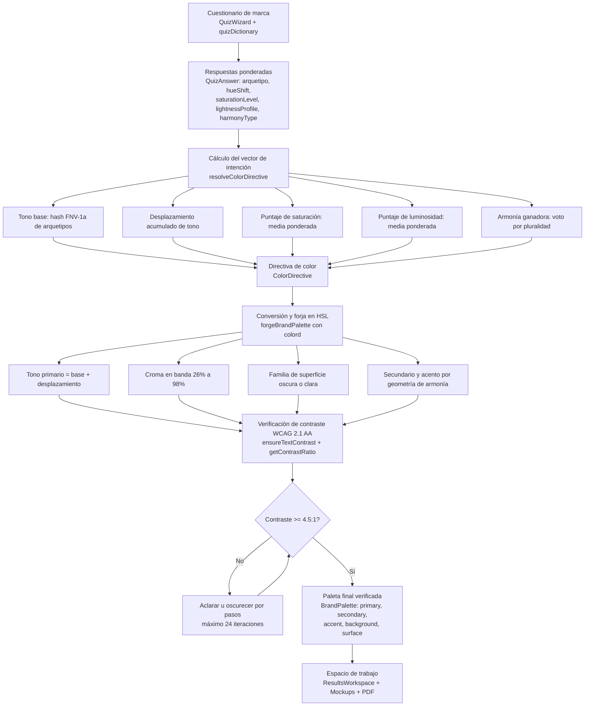
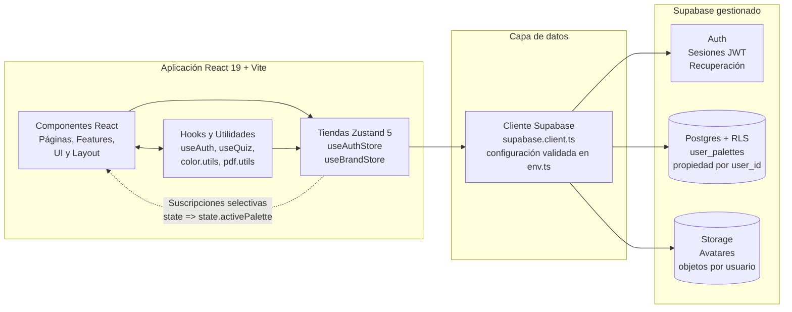

# ChromaForge

> **Forja identidades visuales algorítmicas, accesibles y listas para producción.**
> Convierte un cuestionario de marca en un sistema visual completo: paleta verificada por WCAG, maquetas interactivas y guía de marca exportable en PDF — con estética Dark Cyber-SaaS.

[](https://react.dev/)
[](https://www.typescriptlang.org/)
[](https://vitejs.dev/)
[](https://supabase.com/)
[](https://zustand.docs.pmnd.rs/)
[](https://tailwindcss.com/)
[](https://www.w3.org/WAI/standards-guidelines/wcag/)


---

## Tabla de Contenidos

1. [Descripción General](#-descripción-general)
2. [Características Principales](#-características-principales)
3. [Arquitectura y Flujo de Trabajo](#-arquitectura-y-flujo-de-trabajo)
4. [Stack Tecnológico](#-stack-tecnológico)
5. [Instalación Local](#-instalación-local)
6. [Variables de Entorno](#-variables-de-entorno)
7. [Scripts Disponibles](#-scripts-disponibles)
8. [Estructura del Proyecto](#-estructura-del-proyecto)
9. [Seguridad](#-seguridad)
10. [Rendimiento](#-rendimiento)
11. [Licencia](#-licencia)

---

## 📖 Descripción General

**ChromaForge** es una aplicación web interactiva que transforma las respuestas de un cuestionario de marca en un sistema de identidad visual completo, equilibrado matemáticamente y verificado por accesibilidad.

El flujo central es deliberadamente simple para el usuario y riguroso por dentro:

1. La persona usuaria completa un **asistente de cuestionario** sobre personalidad, croma, valor y armonía de la marca.
2. El **Motor de Generación de Color** agrega esas respuestas en un vector de intención determinista y deriva una paleta de cinco roles en espacio HSL.
3. Cada rol legible se verifica y corrige automáticamente hasta alcanzar el umbral **WCAG 2.1 AA (contraste 4.5:1)** para texto normal.
4. El resultado se presenta en un **espacio de trabajo visual** con muestras de color, previsualizaciones aplicadas, verificación de accesibilidad y maquetas de marca.
5. La identidad se guarda en la biblioteca personal y se exporta como **guía de marca en PDF**.

Casos de uso representativos:

- Fundadores y equipos de mercadotecnia que necesitan una identidad coherente en minutos.
- Diseñadores que requieren un punto de partida algorítmico con contraste garantizado.
- Equipos de producto que documentan tokens de color y reglas de uso para desarrollo.

Principios del producto:

- **Reactividad instantánea:** cada respuesta actualiza maquetas y muestras en tiempo real mediante selectores atómicos de Zustand.
- **Accesibilidad obligatoria:** ningún color legible se publica sin superar la verificación de contraste.
- **Estética Cyber-SaaS oscura:** obsidiana profunda, glassmorphism, mallas de degradado dinámicas y tipografía fluida.
- **Grado empresarial:** tipado estricto, saneamiento de entradas, seguridad a nivel de fila y estados explícitos de carga y error.

---

## ✨ Características Principales

- **Generación algorítmica en tiempo real:** cuestionario por pasos que alimenta un motor determinista de color. Cada cambio recalcula la paleta y actualiza la interfaz sin recargas.
- **Motor de color multidimensional:** agregación por hash FNV-1a, desplazamiento de tono acumulado, promedios ponderados de saturación y luminosidad, y voto de armonía por pluralidad.
- **Validación WCAG 2.1 automática:** cálculo de luminancia relativa y relación de contraste con `colord`, corrección iterativa de luminosidad y reporte de niveles AA y AAA.
- **Espacio de trabajo de resultados:** muestras de color, previsualización tipográfica, previsualización aplicada y verificación de accesibilidad en una sola superficie.
- **Exportación de guía en PDF:** generación de documento de lineamientos con `jspdf` e instantáneas con `html2canvas`.
- **Autenticación completa con Supabase Auth:** registro, inicio de sesión, recuperación y actualización de contraseña, y restauración persistente de sesión antes del primer renderizado.
- **Seguridad con Row Level Security (RLS):** todas las filas de `user_palettes` pertenecen a su propietario mediante `auth.uid() = user_id`, con filtro explícito de `user_id` en el cliente como defensa en profundidad.
- **Biblioteca personal de marcas:** guardado, listado ordenado por fecha, reapertura exacta en el espacio de trabajo y eliminación optimista con reversión ante fallos.
- **Recorte de avatar:** selección y encuadre de imagen de perfil con `react-easy-crop` y persistencia en Supabase Storage.
- **Rutas protegidas y públicas:** guardianes `ProtectedRoute` y `PublicRoute`, transiciones de ruta, restauración de desplazamiento y página 404 dedicada.
- **Saneamiento contra XSS:** todo texto libre se sanea con DOMPurify antes de persistirse o renderizarse, con rechazo de patrones peligrosos.
- **Notificaciones transitorias:** retroalimentación inmediata de éxito y error con `sonner` montado en la raíz.
- **Panel con cuadrícula Bento:** organización asimétrica de identidades guardadas mediante tarjetas de paleta reutilizables.
- **Documentación legal y funcional en Markdown:** páginas de privacidad, términos, cookies y documentación general renderizadas de forma segura.
- **Diseño responsivo Mobile-First:** tipografía fluida con `clamp()`, cuadrículas adaptativas y cabecera fija con pie anclado.

---

## 🏗️ Arquitectura y Flujo de Trabajo

### Motor de Generación de Color

El motor es puro, determinista y sin efectos secundarios. Vive en `src/utils/color.utils.ts` y es orquestado por `useBrandStore`, lo cual facilita su prueba unitaria y su reutilización.



Notas del flujo:

- Una colección vacía de respuestas produce una directiva neutral basada en una semilla de respaldo, de modo que el sistema jamás queda en un estado indefinido.
- Los roles legibles se corrigen contra la superficie generada, no contra un fondo arbitrario.
- Cuando dos roles colapsan en el mismo valor, el motor los separa para preservar tres acentos distinguibles.
- Todos los valores hexadecimales finales se normalizan en mayúsculas y en orden de roles.

### Arquitectura de Alto Nivel

Separación clara entre presentación, estado del cliente, cliente de datos y servicios gestionados.



Responsabilidades por capa:

- **Componentes React:** presentación, interacción y navegación. No contienen SQL ni credenciales.
- **Tiendas Zustand:** ciclo de vida de la paleta activa, carga, errores y biblioteca guardada. La computación pesada se delega a utilidades puras.
- **Servicios:** clientes externos, generación de PDF, saneamiento y envoltorios de Supabase.
- **Supabase:** autenticación, persistencia relacional con RLS y almacenamiento de objetos.

---

## 🧰 Stack Tecnológico

| Categoría | Tecnología | Versión | Propósito |
|---|---|---|---|
| Núcleo de UI | React + React DOM | 19.0 | Componentes, composición y renderizado |
| Lenguaje | TypeScript | 5.7 | Tipado estricto y modelos de dominio |
| Empaquetador | Vite | 6.0 | Desarrollo rápido y construcción optimizada |
| Enrutamiento | React Router DOM | 7.0 | Rutas públicas, protegidas y documentos |
| Estado global | Zustand | 5.0 | Sesión, cuestionario y ciclo de marca |
| Backend | Supabase JS | 2.45 | Auth, Postgres, RLS y Storage |
| Colorimetría | Colord | 2.9 | Conversión HSL, luminancia y contraste WCAG |
| Exportación | jsPDF | 2.5 | Generación de guía de marca en PDF |
| Captura visual | html2canvas | 1.4 | Instantáneas para el documento exportado |
| Recorte de imagen | React Easy Crop | 6.2 | Encuadre de avatar antes de subirlo |
| Iconografía | Lucide React | 1.0 | Iconos consistentes de la interfaz |
| Saneamiento | DOMPurify | 3.1 | Prevención de XSS en texto de usuario |
| Contenido | React Markdown + remark-gfm | 10.1 + 4.0 | Documentos legales y guías en Markdown |
| Notificaciones | Sonner | 1.7 | Avisos transitorios de éxito y error |
| Utilidades CSS | clsx + tailwind-merge | 2.1 + 2.5 | Composición condicional de clases |
| Estilos | Tailwind CSS + Sass | 3.4 + 1.80 | Utilidades, módulos SCSS y tokens de diseño |
| Pruebas | Vitest + Testing Library + jsdom | 2.1 + 16.0 + 25.0 | Pruebas unitarias y de componentes |
| Calidad | ESLint + typescript-eslint | 10.8 + 8.65 | Reglas de lint y de hooks de React |

---

## 💻 Instalación Local

### Requisitos previos

- **Node.js:** versión 20 LTS o superior.
- **npm:** versión 10 o superior.
- **Cuenta de Supabase:** proyecto activo con Auth habilitado.
- **Git:** para clonar el repositorio.

### Paso 1: Clonar el repositorio

```bash
git clone https://github.com/tu-organizacion/chromaforge.git
cd chromaforge
```

### Paso 2: Instalar dependencias

```bash
npm install
```

### Paso 3: Configurar variables de entorno

```bash
cp .env.example .env
```

Abra el archivo `.env` y complete los valores públicos de su proyecto de Supabase. No agregue claves privilegiadas con prefijo `VITE_`.

### Paso 4: Preparar la base de datos

1. En el panel de Supabase, cree la tabla `user_palettes` con las columnas `id`, `user_id`, `name`, `colors`, `quiz_answers` y `created_at`.
2. Active Row Level Security en la tabla.
3. Cree políticas que limiten lectura, escritura y eliminación a `auth.uid() = user_id`.
4. Configure un depósito de Storage para avatares con políticas por propietario.

### Paso 5: Iniciar el servidor de desarrollo

```bash
npm run dev
```

Abra `http://localhost:5173` en el navegador. La aplicación recarga automáticamente ante cada cambio.

### Paso 6: Verificar la instalación

1. Registre una cuenta local desde `/auth`.
2. Complete el cuestionario en `/quiz`.
3. Confirme que la paleta aparece en `/dashboard`.
4. Guarde una identidad y verifique que persiste en `/brands`.

---

## 🔑 Variables de Entorno

Todas las variables expuestas al navegador deben usar el prefijo `VITE_`. Vite las incrusta en el paquete del cliente, por lo cual **jamás deben considerarse secretas**.

| Variable | Requerida | Descripción | Ejemplo |
|---|---|---|---|
| `VITE_SUPABASE_URL` | Sí | URL pública del proyecto de Supabase. Identifica el backend al cual se conecta la aplicación. | `https://abcd1234.supabase.co` |
| `VITE_SUPABASE_ANON_KEY` | Sí | Clave anónima publicable. Opera bajo RLS y es segura para el navegador. | `eyJhbGciOiJIUzI1NiIsInR5cCI6IkpXVCJ9...` |
| `SUPABASE_SERVICE_ROLE_KEY` | Nunca en el cliente | Clave privilegiada que omite RLS. Debe permanecer exclusivamente en el servidor. No utilice el prefijo `VITE_`. | No aplicable |
| `SUPABASE_ACCESS_TOKEN` | Nunca en el cliente | Token de gestión del proyecto. No debe incluirse en el paquete web. | No aplicable |

Reglas de seguridad para la configuración:

- Centralice la lectura en `src/config/env.ts` en lugar de acceder a `import.meta.env` directamente.
- La aplicación falla de forma explícita al iniciar cuando falta una variable pública requerida.
- La presencia de `VITE_SUPABASE_SERVICE_ROLE_KEY` provoca un error inmediato, pues indica una exposición accidental de privilegios.
- Nunca registre valores de entorno en la consola ni en mensajes de error visibles.

---

## 📜 Scripts Disponibles

| Comando | Descripción |
|---|---|
| `npm run dev` | Inicia el servidor de desarrollo de Vite con recarga en caliente. Úselo para el trabajo diario en la interfaz. |
| `npm run build` | Ejecuta la verificación de tipos con `tsc -b` y genera el paquete optimizado para producción en `dist/`. |
| `npm run preview` | Sirve localmente el resultado de `npm run build` para validar el comportamiento productivo antes del despliegue. |
| `npm run lint` | Analiza todo el repositorio con ESLint, incluidas las reglas de hooks de React y de actualización de componentes. |
| `npm run test` | Ejecuta la suite de pruebas con Vitest en modo único. Cubre utilidades puras y componentes críticos. |
| `npm run test:watch` | Ejecuta Vitest en modo observador durante el desarrollo guiado por pruebas. |

Flujo recomendado:

```bash
npm run dev
npm run lint
npm run test
npm run build
npm run preview
```

---

## 🗂️ Estructura del Proyecto

```text
src/
├── assets/                 # Recursos estáticos: imágenes, vectores e iconos
├── components/             # Componentes reutilizables y atómicos
│   ├── ui/                 # Botón, modal, insumo, tarjeta, distintivo y avisos
│   ├── layout/             # Cabecera, pie, rutas protegidas y transiciones
│   ├── results/            # Espacio de resultados, maquetas y tipografía
│   ├── dashboard/          # Tarjetas de paleta y superficies del panel
│   ├── background/         # Fondos dinámicos y campos de aurora
│   ├── brand/              # Identidad propia de ChromaForge
│   └── common/             # Visor de Markdown y utilidades compartidas
├── features/               # Módulos de dominio organizados por función
├── pages/                  # Superficies de ruta: inicio, auth, quiz, panel y perfil
├── hooks/                  # Hooks compartidos de React
├── lib/                    # Ayudantes compartidos, por ejemplo combinación de clases
├── services/               # Clientes externos: Supabase, avatar, PDF y saneamiento
├── store/                  # Tiendas Zustand: autenticación y marca
├── styles/                 # Tokens SCSS, tipografía, animaciones y estilos globales
├── types/                  # Interfaces TypeScript de auth, marca y Supabase
├── utils/                  # Funciones puras: color, PDF, saneamiento y auth
├── config/                 # Frontera centralizada de configuración pública
├── data/                   # Diccionario del cuestionario y ponderaciones
├── App.tsx                 # Definición de rutas y estructura general
└── main.tsx                # Punto de entrada de React 19 con createRoot
```

Convenciones arquitectónicas:

- Las páginas orquestan; los componentes presentan; las tiendas coordinan; los servicios integran.
- La lógica pura de color permanece fuera de React para facilitar su prueba.
- Las consultas a Supabase viven en la capa de datos, no dispersas en la presentación.
- El estado local de la interfaz permanece en React; solo el estado compartido reside en Zustand.

---

## 🔒 Seguridad

- **Aislamiento de credenciales:** únicamente la URL y la clave anónima usan el prefijo `VITE_`. La clave de servicio jamás llega al navegador.
- **RLS estricto:** cada fila está limitada a su propietario. El cliente incluye además el filtro `user_id` como defensa en profundidad.
- **Saneamiento sistemático:** nombres de marca y descripciones se procesan con DOMPurify antes de persistirse.
- **Validación en tiempo de ejecución:** los datos externos se tratan como no confiables. Los tipos de TypeScript no sustituyen la validación.
- **Manejo explícito de errores:** sin capturas silenciosas. Los fallos de guardado, carga y eliminación generan mensajes recuperables en español.
- **Superficies mínimas:** las rutas de recuperación ocultan la navegación general para no revelar el estado de sesión.

---

## ⚡ Rendimiento

- **División de código por ruta y por proveedor:** los paquetes de React, Supabase, PDF y utilidades se separan mediante `manualChunks` en `vite.config.ts`.
- **Suscripciones selectivas:** cada componente se suscribe a fragmentos mínimos del estado para evitar renderizados innecesarios.
- **Cálculos puros y memorizables:** el motor de color evita trabajo durante el renderizado y permanece libre de acceso al DOM.
- **Alias de importación:** la ruta `@` apunta a `src` para límites de módulo claros y refactorizaciones seguras.
- **Objetivos de Core Web Vitals:** primer pintado con contenido en menos de 1.2 segundos y mayor pintado con contenido en menos de 2.0 segundos.

---

## 📄 Licencia

Proyecto privado en su versión actual. Todos los derechos reservados salvo indicación contraria en un acuerdo de licencia específico.

Si publica una versión de código abierto, agregue aquí el texto completo de la licencia correspondiente y el aviso de atribución de las dependencias.

---

<p align="center">
  <strong>ChromaForge</strong> — Forjado algorítmico. Contraste garantizado. Marca lista para producción.
</p>
